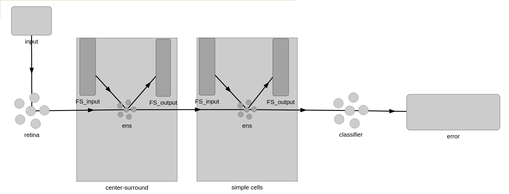

# Vision-with-Function-Spaces

This repo contains an experimental ipython notebook for a spiking model of the early stages of the visual system. The model is constructed using a chain of function space layers of Gabor filters, with larger receptive fields in higher layers, and is applied to MNIST recognition.

